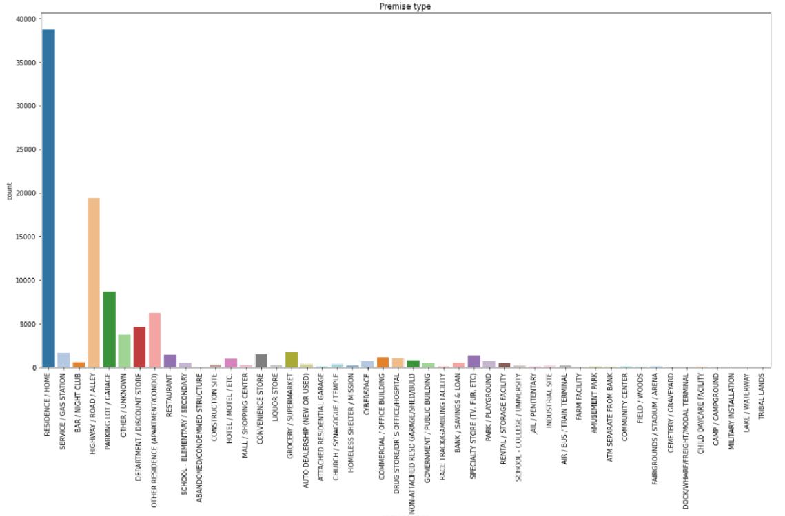
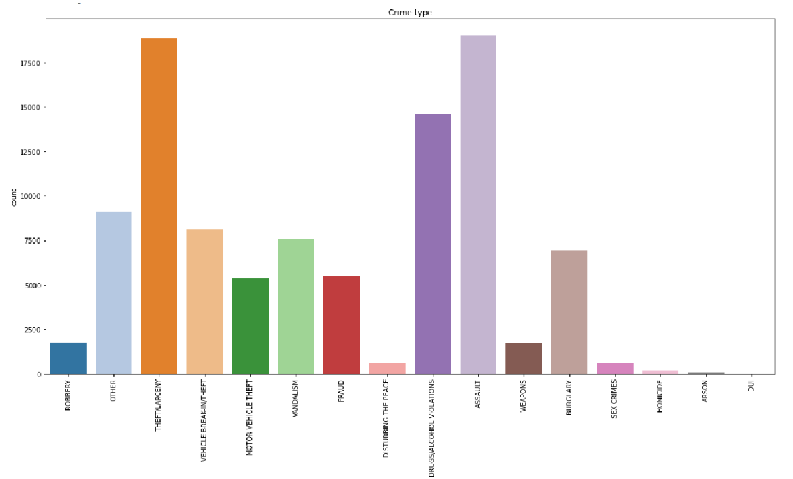

# Crime_Reports_Statistical_Analysis
Dataset: https://data.louisvilleky.gov/dataset/crime-reports  
In this project, after cleaning data, I performed statistical analysis on crime reports from 2015 to 2019 recorded in The Louisville Metro Police Department using Seaborn and Matplotlib packages. 
By analyzing the YEAR_occ column of the data, I realized the fact that some crimes were reported after several years which I have no idea why! 
Also, I got a vivid view of the volume of crimes occurring in each location. Below, you can see its plot. 

  

 

In the plot below, you can see what crimes are more common. 

  

